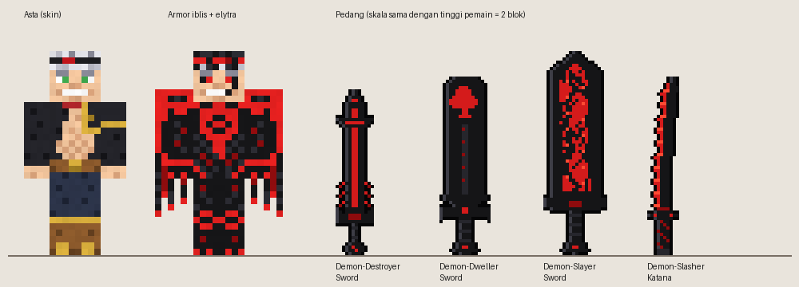
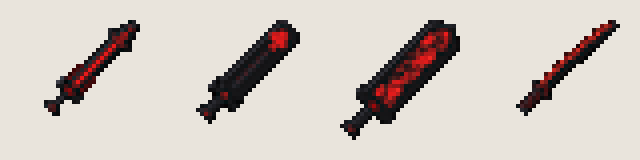

# Asta (Black Clover) untuk Minecraft Bedrock

Paket bertema **Asta** dari *Black Clover*:

| Isi | Keterangan |
|---|---|
| 🧍 **Skin Asta** | 64×64 (model klasik), rambut perak, ikat kepala, jubah Banteng Hitam, sabuk & sepatu cokelat. Bonus: skin **Asta Mode Iblis**. |
| 🛡️ **Armor Iblis** | Wujud Devil Union (tanpa sayap): helm rambut hitam + ikat merah + mata merah + tanduk, zirah dada dengan lambang merah, sarung tangan bercakar, celana & sepatu iblis. **Menggantikan tampilan armor Netherite.** |
| 🪽 **Elytra Sayap Iblis** | Sayap hitam compang-camping dengan tulang merah. **Menggantikan tampilan Elytra.** |
| ⚔️ **4 Pedang Iblis** | Item baru dengan model 3D di tangan, **ukurannya mengikuti lore** (Demon-Slayer paling besar). |

| | |
|---|---|
| **Versi game** | Minecraft Bedrock **1.26.30 ke atas** |
| **Eksperimen** | Tidak perlu |

---

## Pedang & Resep

Resep **tanpa bentuk (shapeless)** di **Meja Kerajinan**: taruh **pedang apa saja** (kayu, batu, besi, emas,
berlian, netherite, atau pedang iblis lain) + **1 ingot**:

| Bahan | Hasil | Damage | Durabilitas | Panjang (lore) |
|---|---|---|---|---|
| Pedang apa saja + **Iron Ingot** | **Demon-Destroyer Sword** (Pedang Penghancur Iblis) | 8 | 1200 | ±1,6 blok, ramping |
| Pedang apa saja + **Gold Ingot** | **Demon-Dweller Sword** (Pedang Penghuni Iblis) | 9 | 1500 | ±1,75 blok, lebar |
| Pedang apa saja + **Diamond** | **Demon-Slayer Sword** (Pedang Pembasmi Iblis) | 10 | 2031 | **2 blok** (setinggi Asta), sangat lebar |
| Pedang apa saja + **Netherite Ingot** | **Demon-Slasher Katana** (Katana Penebas Iblis) | 11 | 2500 | ±1,75 blok, melengkung |

> Berlian memakai item `minecraft:diamond` (Bedrock tidak punya "diamond ingot").
> Semua pedang iblis bisa di-enchant seperti pedang biasa dan diperbaiki di Anvil dengan Netherite Ingot.



---

## Cara Pasang

Unduh dari folder [`dist/`](dist):

| File | Fungsi |
|---|---|
| [`Asta.mcaddon`](dist/Asta.mcaddon) | Pedang iblis + armor iblis + elytra (BP + RP). **Pakai ini.** |
| [`Asta_RP.mcpack`](dist/Asta_RP.mcpack) | Hanya tekstur armor & elytra (untuk dunia tanpa addon) |
| [`Asta_Skin.mcpack`](dist/Asta_Skin.mcpack) | Skin pack Asta (Asta + Asta Mode Iblis) |
| [`asta.png`](dist/asta.png), [`asta_iblis.png`](dist/asta_iblis.png) | File skin untuk diimpor langsung |

1. Buka `Asta.mcaddon` dengan Minecraft, tunggu *Import berhasil*.
2. Di pengaturan dunia → **Behavior Packs** → aktifkan **Asta BP** (Asta RP ikut aktif otomatis).
3. **Skin**: buka **Ruang Ganti → Edit Karakter → Skin Klasik → Impor → Pilih skin baru** → pilih `asta.png`,
   lalu pilih model **klasik (lengan lebar)**. Atau buka `Asta_Skin.mcpack` (skin pack).

Addon ini bisa dipasang bersama addon **Rakitin** (folder [`../raft`](../raft)).

---

## Catatan

- Armor iblis & elytra adalah **pengganti tekstur** (armor Netherite & Elytra). Ikon item-nya ikut diganti.
- Model pedang di tangan memakai *attachable* dengan posisi pegang yang sama seperti **trident vanilla**.
  Jika posisinya kurang pas di perangkatmu, ubah angka di
  [`Asta_RP/animations/asta_pedang.animation.json`](Asta_RP/animations/asta_pedang.animation.json)
  atau `GRIP_Y` di `tools/buat_asta.py`.
- Karakter & nama milik © Yūki Tabata / Shueisha. Semua tekstur di sini adalah pixel art buatan sendiri
  (prosedural), tidak memakai aset resmi.

## Untuk Pengembang

```
Asta_Skin/   skin pack (manifest, skins.json, asta.png, asta_iblis.png)
Asta_RP/     tekstur armor (textures/models/armor/netherite_1|2.png), elytra,
             ikon, sprite pedang, attachables/, models/entity/, animations/, texts/
Asta_BP/     items/ (4 pedang), recipes/ (4 resep shapeless)
tools/
  buat_asta.py   generator SEMUA gambar & JSON
  build.sh       membuat dist/
docs/        pratinjau
dist/        paket siap pasang
```

```bash
cd Asta
pip install pillow
python3 tools/buat_asta.py
./tools/build.sh
```
