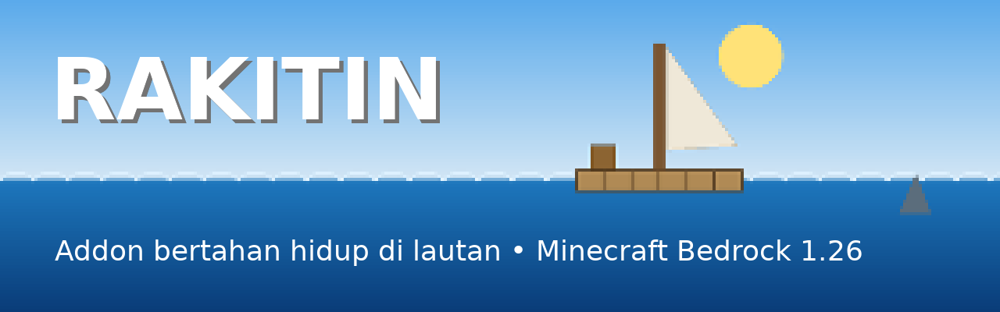
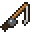
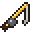
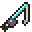
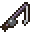
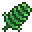
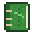
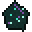

# Rakitin: Addon Raft untuk Minecraft Bedrock

**Rakitin** adalah addon bertahan hidup di tengah lautan, terinspirasi dari game *Raft*.
Kamu mulai di atas rakit kecil, harus menjaga **haus**, memancing barang dengan **kail 5 tier**,
mengumpulkan **puing hanyut**, melawan **hiu**, berlayar mencari **pulau**, sampai akhirnya
membuka **Portal End** dan mengalahkan **Naga Ender** untuk menang.

| | |
|---|---|
| **Versi game** | Minecraft Bedrock **1.26.30 ke atas** (dibuat & divalidasi untuk **1.26.52**, Play Store) |
| **Script API** | `@minecraft/server` 2.4.0 + `@minecraft/server-ui` 2.0.0 (stabil, **tidak perlu Beta API**) |
| **Mode** | Survival (Kreatif tetap bisa dipakai untuk mencoba) |
| **Pemain** | Satu pemain & multipemain |

📜 **[Daftar resep lengkap bergambar → docs/RESEP.md](docs/RESEP.md)**

---

## Daftar Isi
1. [Fitur](#fitur)
2. [Cara Pasang (Android / Play Store)](#cara-pasang-android--play-store)
3. [Membuat Dunia](#membuat-dunia)
4. [Cara Bermain](#cara-bermain)
5. [Kail & Peluang Tangkapan](#kail--peluang-tangkapan)
6. [Item & Blok Baru](#item--blok-baru)
7. [Pencapaian](#pencapaian)
8. [Untuk Pengembang](#untuk-pengembang)
9. [Masalah Umum](#masalah-umum)

---

## Fitur

- 🛶 **Mulai di atas rakit**: saat pertama masuk dunia, rakit 5×5 dibuat otomatis di permukaan air dan kamu dipindahkan ke atasnya.
- 📦 **Peti perlengkapan awal** berisi kail Tier 1 ber-enchant maksimal, botol, air bersih, tombak, roti, api unggun, fondasi rakit, plastik, dan Buku Catatan.
- 💧 **Mekanisme haus** dengan bar di layar. Minum air bersih, rebus/saring air laut, atau tampung air hujan.
- 🎣 **Kail 5 tier** (Kayu → Besi → Emas → Berlian → Netherite) dengan **enchant maksimal** (Lure III, Luck of the Sea III, Unbreaking III, Mending). Tier lebih tinggi berarti hasil lebih bagus dan peluang tangkapan ganda.
- 🌀 **Tabel tangkapan seimbang**: sampah, ikan, blok, bahan, langka, harta, dan bahan portal (khusus Tier 5).
- 🪵 **Puing hanyut** (papan, plastik, daun palem, barel) yang terbawa arus laut.
- 🦈 **Hiu** yang menyerang pemain di air dan **menggigit fondasi rakit**.
- 🧪 **Penyaring Air**, 🌧️ **Penampung Air Hujan**, 🌱 **Pot Tanam**.
- ⛵ **Layar & Kemudi**: rakit benar-benar **berlayar** (seluruh bangunan dan isi peti ikut pindah).
- 🏝️ **Pulau kecil langka** dengan pohon dan peti harta.
- 🗡️ **Tombak** anti-hiu, ⚡ **badai** yang membuat hiu lebih ganas.
- 🏆 **13 pencapaian** dengan hadiah, plus **Buku Catatan** untuk melihat statistik dan panduan.
- 🐉 **Tujuan akhir**: kumpulkan Pecahan Portal, buat **Inti Portal End**, lalu kalahkan **Naga Ender**.

---

## Cara Pasang (Android / Play Store)

### Cara 1: file `.mcaddon` (paling mudah)
1. Unduh **[`dist/Rakitin.mcaddon`](dist/Rakitin.mcaddon)** dari repo ini (tombol *Download raw file*).
2. Buka file tersebut dari aplikasi *File* / *Unduhan*, lalu pilih **Minecraft**.
3. Tunggu sampai muncul pesan *Import berhasil* untuk **Rakitin BP** dan **Rakitin RP**.

### Cara 2: salin folder manual
Salin folder `Rakitin_BP` dan `Rakitin_RP` ke:
```
Android/data/com.mojang.minecraftpe/files/games/com.mojang/behavior_packs/Rakitin_BP
Android/data/com.mojang.minecraftpe/files/games/com.mojang/resource_packs/Rakitin_RP
```

---

## Membuat Dunia

1. **Buat Dunia Baru** dengan mode **Survival**.
2. Buat dunia yang **seluruhnya air** dengan cara yang biasa kamu pakai.
3. Buka **Paket Perilaku (Behavior Packs)** → aktifkan **Rakitin BP**. Resource pack **Rakitin RP** ikut aktif otomatis.
4. Tidak perlu menyalakan *Beta API* atau eksperimen apa pun.
5. Masuk ke dunia. Rakit dan peti awal dibuat **otomatis** di bawah posisimu, dan titik respawn dipasang di rakit.

> Jika titik spawn ternyata di daratan, rakit tetap dibuat di atas tanah. Fitur laut (puing, hiu, pulau)
> memakai ketinggian permukaan air yang terdeteksi saat rakit dibuat (bawaan: y = 62).

---

## Cara Bermain

### 💧 Haus
- Bar haus (0–20) tampil di atas hotbar: `Haus ■■■■■■■■■■ 20`.
- Turun dari penuh sampai habis dalam ±12 menit. Lebih cepat saat **berlari** (×2), **berenang** (×1,5), dan di **Nether** (×2).
- Haus ≤ 6 → lambat (Slowness). Haus 0 → terkena damage 1 setiap 4 detik.
- Setelah mati dan respawn, haus kembali penuh.

| Minuman | Haus | Efek |
|---|---|---|
| Botol Air Bersih | +8 | — |
| Botol Air Laut | +3 | Mual & lapar sebentar |
| Susu, Sup, Botol Madu | +3 / +4 | — |
| Botol air vanilla (potion) | +2 | — |
| Semangka | +1 | — |

**Mendapatkan air bersih:**
1. Klik kanan **Botol Kosong** ke air laut untuk mendapat **Botol Air Laut**.
2. Ubah menjadi air bersih dengan salah satu cara:
   - **Penyaring Air**: klik kanan memakai Air Laut, tunggu ±30 detik, lalu klik kanan memakai Botol Kosong.
   - **Rebus** di Tungku atau Api Unggun.
   - **Penampung Air Hujan**: terisi sendiri saat hujan (maks 4 botol) jika di bawah langit terbuka.

### 🪵 Puing Hanyut
Puing muncul dari arah arus laut lalu hanyut melewati rakitmu. Cara mengambil:
- Dekati sampai ±2 blok, **pukul**, atau **lempar kail** ke dekatnya.
- Puing yang menabrak rakit akan berhenti di tepi rakit.

| Puing | Isi |
|---|---|
| Papan Hanyut | 1–3 papan kayu (kadang tongkat) |
| Sampah Plastik | 1–2 plastik |
| Daun Palem | 1–2 daun palem (kadang benang) |
| Barel Terapung | 3–5 barang acak: bibit, kentang, besi tua, sapling, tanah, air bersih, dll |

### 🦈 Hiu
- Muncul setelah 2,5 menit pertama. Maksimal 1 hiu per pemain, +1 saat malam, +1 saat badai.
- **Menyerang pemain yang berada di air.**
- Sesekali berenang ke tepi rakit dan **menggigit Fondasi Rakit** (4 gigitan = 1 blok hancur). Akan muncul peringatan sebelumnya.
- **Pukul hiu** supaya kabur. **Tombak** memberi +6 damage tambahan ke hiu.
- **Fondasi Diperkuat tidak bisa digigit.**
- Hiu menjatuhkan **Daging Hiu** dan **Gigi Hiu** (bahan upgrade kail).

### 🌱 Pot Tanam
Klik kanan memakai bibit gandum, kentang, wortel, atau bibit bit. Tanaman tumbuh 3 tahap (±1–2 menit per tahap). Bisa dipercepat dengan **Bone Meal**. Klik kanan saat matang untuk memanen.

### ⛵ Berlayar
1. Pasang **Kemudi** tepat di atas Fondasi Rakit.
2. Pasang **Layar** di atas rakit (1 layar: lambat, 2 layar: sedang, 3 layar atau lebih: cepat).
3. **Klik kanan Kemudi** sambil menghadap arah tujuan. Rakit bergerak 1 blok per langkah.
4. Klik kanan Kemudi lagi untuk berhenti. Rakit juga berhenti jika menabrak sesuatu.

> Ukuran rakit maksimal untuk berlayar 32×32. Bangunan sampai 8 blok di atas lantai rakit ikut pindah, termasuk isi peti.

### 🏝️ Pulau
Saat menjelajah, kadang muncul pulau kecil 40–50 blok di sekitarmu (searah pelayaran jika sedang berlayar). Pulau berisi pohon, rumput, dan **peti harta** (10% berisi Pecahan Portal).

### 🐉 Menang: Mengalahkan Naga Ender
1. Upgrade kail sampai **Tier 5 (Netherite)**.
2. Kumpulkan **8 Pecahan Portal** + **1 Mata Ender** (Mata Ender, Mutiara Ender, dan Batang Blaze juga bisa dipancing di Tier 5).
3. Buat **Inti Portal End**, lalu **klik kanan** di atas rakit. Portal End 5×5 yang **langsung aktif** dibangun 3 blok di depanmu.
4. Siapkan senjata, baju besi, makanan, blok, dan panah, lalu kalahkan Naga Ender.
5. Saat naga mati, semua pemain mendapat layar **"KAMU MENANG!"**.

### 📖 Buku Catatan Rakit
Klik kanan untuk melihat statistik (haus, hari bertahan, tangkapan, puing, hiu, pulau), daftar pencapaian, dan panduan singkat di dalam game.

---

## Kail & Peluang Tangkapan

| Tier | Kail | Sampah | Ikan | Blok | Bahan | Langka | Harta | Portal | Tangkapan ganda |
|:-:|---|:-:|:-:|:-:|:-:|:-:|:-:|:-:|:-:|
| 1 |  Kayu | 30% | 35% | 25% | 8% | 2% | 0% | 0% | 0% |
| 2 |  Besi | 22% | 33% | 27% | 13% | 4% | 1% | 0% | 0% |
| 3 |  Emas | 15% | 30% | 28% | 18% | 7% | 2% | 0% | 5% |
| 4 |  Berlian | 10% | 27% | 28% | 22% | 10% | 3% | 0% | 10% |
| 5 |  Netherite | 5% | 25% | 25% | 23% | 11% | 5% | **6%** | 20% |

**Isi tiap kategori:**
- **Sampah:** benang, tongkat, plastik, kelp, tulang, daging busuk, mangkuk, kulit, kantung tinta, kait tripwire
- **Ikan:** cod, salmon, ikan tropis, ikan buntal
- **Blok:** papan kayu, kayu gelondong, cobblestone, tanah, pasir, **sapling ek**, bibit gandum, kerikil, tanah liat
- **Bahan:** batu bara, besi mentah, **besi tua**, nugget besi, tembaga mentah, redstone, nugget emas, lapis, flint, kentang, wortel, bibit bit, tebu
- **Langka:** batangan emas, emas mentah, **berlian**, zamrud, botol XP, cangkang nautilus, panah, obsidian, name tag, busur, wortel emas, pelana, sapling langka
- **Harta:** berlian, **serpihan netherite**, apel emas, botol XP, zamrud, totem, *heart of the sea*, trisula, blok besi, apel emas ber-enchant
- **Portal (Tier 5):** **Pecahan Portal**, Mata Ender, Mutiara Ender, Batang Blaze

**Cara upgrade kail:**
1. Buka **Meja Kerajinan**. Semua kail Rakitin di inventorimu otomatis berubah menjadi *item kail* agar bisa dipakai sebagai bahan resep.
2. Susun resep upgrade (lihat [RESEP.md](docs/RESEP.md#meja-kerajinan)).
3. **Klik kanan item kail** untuk mengaktifkannya kembali menjadi pancingan ber-enchant maksimal.

> Estimasi waktu dari Tier 1 sampai Tier 5 ±1,5–2 jam bermain, lalu ±30–40 menit lagi untuk Pecahan Portal.
> Hasil pancingan vanilla diganti sepenuhnya dengan tabel di atas. Pancingan biasa (tanpa tier) dihitung sebagai Tier 1.

---

## Item & Blok Baru

| Ikon | Nama | Cara dapat | Kegunaan |
|:-:|---|---|---|
|  | Plastik | Puing, pancingan (sampah) | Bahan utama rakit & alat |
|  | Daun Palem | Puing | Layar, benang, tanah kompos, buku |
|  | Besi Tua | Barel, pancingan (bahan) | Lebur jadi besi, kemudi, tombak |
|  | Gigi Hiu | Hiu | Upgrade kail Tier 3–5 |
|  | Daging Hiu Mentah/Matang | Hiu | Makanan (matang: 8 lapar) |
|  | Botol Kosong | Resep / peti awal | Mengambil air laut / air bersih |
|  | Botol Air Laut | Botol kosong + air laut | Minum darurat, bahan air bersih |
|  | Botol Air Bersih | Penyaring, rebus, penampung | Minum (+8 haus) |
|  | Tombak | Resep | Senjata, +6 damage ke hiu |
|  | Buku Catatan Rakit | Resep / peti awal | Statistik, pencapaian, panduan |
|  | Kail Tier 1–5 | Resep upgrade | Memancing |
|  | Pecahan Portal | Kail Tier 5, peti pulau | Bahan Inti Portal End |
|  | Inti Portal End | Resep | Membangun Portal End aktif |
|  | Fondasi Rakit | Resep | Lantai rakit (bisa dipasang di air) |
|  | Fondasi Diperkuat | Resep | Lantai rakit anti-hiu |
|  | Penyaring Air | Resep | Air laut → air bersih |
|  | Penampung Air Hujan | Resep | Air bersih saat hujan |
|  | Pot Tanam | Resep | Bertani di atas rakit |
|  | Layar | Resep | Menggerakkan rakit |
|  | Kemudi | Resep | Mengendalikan arah rakit |

👉 Resep semua item di atas ada di **[docs/RESEP.md](docs/RESEP.md)**, lengkap dengan gambar susunan di meja kerajinan.

---

## Pencapaian

| Pencapaian | Syarat | Hadiah |
|---|---|---|
| Pemancing Pemula | 10 hasil pancingan | 4 Plastik |
| Pemancing Handal | 100 hasil pancingan | 3 Air Bersih |
| Raja Pancing | 500 hasil pancingan | 3 Berlian |
| Pemulung Laut | 25 puing | 2 Besi Tua |
| Kolektor Samudra | 100 puing | 5 Besi Tua |
| Pemburu Hiu | Kalahkan 1 hiu | 2 Wortel Emas |
| Teror Lautan | Kalahkan 10 hiu | 1 Berlian |
| Arsitek Rakit | Pasang 50 fondasi | 8 Fondasi Diperkuat |
| Penjelajah Pulau | Kunjungi 1 pulau | 2 Sapling Ek |
| Kail Emas | Punya kail Tier 3 | — |
| Kail Pamungkas | Punya kail Tier 5 | 8 Botol XP |
| Seminggu di Laut | Bertahan 7 hari | 1 Apel Emas |
| Penakluk Naga | Kalahkan Naga Ender | — |

---

## Untuk Pengembang

### Struktur folder
```
Rakitin_BP/            Behavior pack
  manifest.json
  blocks/              7 blok custom (format 1.26.20, custom components V2)
  items/               20 item custom (format 1.26.30)
  entities/            hiu.json, puing.json
  recipes/             22 resep (meja kerajinan + tungku)
  loot_tables/         loot hiu
  scripts/             Script API (JavaScript)
    main.js            titik masuk: daftar komponen + nyalakan sistem
    awal.js            rakit & peti awal
    haus.js            mekanisme haus + HUD
    kail.js            kail tier, deteksi tangkapan, konversi upgrade
    loot.js            semua tabel peluang
    puing.js           puing hanyut & arus laut
    hiu.js             kemunculan hiu & gigitan rakit
    blok.js            komponen custom blok & item
    layar.js           berlayar (/structure save/load)
    pulau.js           pulau acak
    portal.js          Inti Portal End & kemenangan
    statistik.js       statistik, pencapaian, Buku Catatan (server-ui)
    cuaca.js           pelacak cuaca
Rakitin_RP/            Resource pack (tekstur, model, animasi, teks)
tools/
  data_rakitin.py      SATU sumber data: item, blok, resep
  buat_data.py         generator JSON item/blok/resep/atlas/teks
  buat_aset.py         generator tekstur, model, ikon, gambar resep
  validasi.py          validasi JSON terhadap skema resmi Mojang
  build.sh             membuat dist/*.mcaddon & *.mcpack
docs/                  banner, ikon, gambar resep, RESEP.md
dist/                  paket siap pasang
```

### Membangun ulang
```bash
pip install pillow jsonschema
python3 tools/buat_data.py      # JSON item, blok, resep, atlas, teks
python3 tools/buat_aset.py      # tekstur, model, gambar resep, RESEP.md
./tools/build.sh                # dist/Rakitin.mcaddon

# Opsional: validasi dengan skema resmi
git clone --depth 1 https://github.com/Mojang/bedrock-samples.git /tmp/bedrock-samples
python3 tools/validasi.py /tmp/bedrock-samples/metadata/json_schemas
```
Untuk menambah atau mengubah resep, edit `tools/data_rakitin.py`, lalu jalankan kedua generator. File JSON resep, gambar, dan `docs/RESEP.md` akan ikut diperbarui.

Peluang tangkapan diatur di `Rakitin_BP/scripts/loot.js` (`PELUANG_KATEGORI` dan `ISI`).

---

## Masalah Umum

| Masalah | Solusi |
|---|---|
| Rakit tidak muncul | Pastikan **Rakitin BP** aktif di dunia. Rakit hanya dibuat sekali per dunia (saat pemain pertama masuk). |
| Tekstur ungu-hitam | **Rakitin RP** belum aktif. Aktifkan di *Paket Sumber Daya*. |
| Kail tidak bisa di-upgrade | Buka meja kerajinan dulu agar kail berubah jadi item, lalu susun resep. |
| Kail berubah jadi item | Normal setelah membuka meja kerajinan. **Klik kanan** item kail untuk memakainya lagi. |
| Rakit tidak mau berlayar | Kemudi harus di atas fondasi, minimal 1 layar, ukuran ≤ 32×32, dan depan rakit harus air terbuka. |
| Ingin melihat error | *Pengaturan → Kreator → Content Log GUI* (nyalakan), lalu kirim isi log saat melapor bug. |

> **Catatan:** saat kail diubah menjadi item (di meja kerajinan), durabilitasnya kembali penuh. Ini disengaja agar upgrade lebih sederhana.
