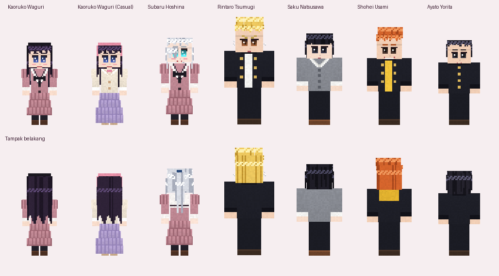

# Waguri YSM: model pemain anime ala *Yes Steve Model* untuk Bedrock

**Yes Steve Model (YSM)** adalah mod Java (Forge/Fabric/NeoForge) yang mengganti tubuh pemain dengan model 3D
custom berformat Bedrock (geometri & animasi Blockbench). Bedrock tidak bisa memakai mod, jadi addon ini
membuat ulang idenya memakai fitur addon resmi:

| Fitur YSM | Di addon ini |
|---|---|
| Ganti tubuh pemain dengan model 3D | Client entity pemain ditimpa; bila model dipilih, render skin vanilla dimatikan dan geometri model digambar |
| Pilih model sendiri | Item **Lemari Model** → menu pilihan (Script API + server-ui) |
| Terlihat oleh pemain lain | Pilihan disimpan sebagai *property* pemain `waguri:model` yang disinkronkan ke semua klien |
| Animasi vanilla tetap jalan | Nama & pivot tulang utama sama dengan skin vanilla → jalan, lari, jongkok, renang, tidur, serang, pegang item, busur, crossbow, perisai, dll. |
| Model detail | Ratusan kubus per karakter: rambut berhelai-helai berlapis, poni runcing, mata terpisah, kerah/pita/kancing/sepatu 3D, rok berlipit |
| Tulang ekstra | Siku (`rightForearm`/`leftForearm`), lutut (`rightShin`/`leftShin`), tulang fisika rambut, ekor kuda, ahoge, rok (4 panel), pita, tudung, serta tulang wajah (mata, kelopak, alis, ekspresi) |
| Animasi ekstra | Kedip, ekspresi senang `^ ^`, siku & lutut menekuk saat berjalan, rambut/ekor kuda/rok/pita bergoyang mengikuti gerak & kepala, napas, tinggi badan sesuai karakter |
| Emote | Melambai, membungkuk (*ojigi*), makan kue, lompat senang, pose damai (V), duduk |
| Tekstur HD | 4 piksel per unit (4x lebih tajam dari skin biasa), satu tekstur per karakter |

| | |
|---|---|
| **Versi game** | Minecraft Bedrock **1.26.30 ke atas** |
| **Eksperimen** | Tidak perlu (`@minecraft/server` 2.4.0 + `@minecraft/server-ui` 2.0.0) |

---

## Karakter: *Kaoru Hana wa Rin to Saku* (The Fragrant Flower Blooms with Dignity)

| # | Model | Tinggi | Ciri |
|---|---|---|---|
| 1 | **Kaoruko Waguri** (seragam Kikyo) | 148 cm (skala 0,84) | Rambut hitam keunguan bergelombang sepinggul, bando hitam, mata biru gelap, seragam pelaut merah muda pudar dengan kerah putih bergaris gelap & pita hitam, lengan menggembung, rok lipit di bawah lutut |
| 2 | **Kaoruko Waguri** (kasual) | 148 cm | Gaya kencan: blus krem, bando merah muda, rok panjang lavender |
| 3 | **Subaru Hoshina** (seragam Kikyo) | skala 0,92 | Rambut perak panjang, ekor kuda tinggi, poni menutupi mata kanan, mata biru laut |
| 4 | **Rintaro Tsumugi** (Chidori) | 190 cm (skala 1,06) | Rambut pirang jabrik (dicat), mata cokelat tajam, 3 anting (1 kiri, 2 kanan), gakuran terbuka |
| 5 | **Saku Natsusawa** | skala 0,97 | Poni hitam panjang sampai pangkal hidung, kemeja putih & kardigan abu-abu, celana hitam, loafer cokelat |
| 6 | **Shohei Usami** (Chidori) | 173 cm (skala 0,96) | Rambut jahe jabrik, senyum lebar, gakuran terbuka di atas hoodie kuning |
| 7 | **Ayato Yorita** (Chidori) | 163 cm (skala 0,90) | Rambut hitam rapi, senyum ramah, gakuran dikancing |

> Detail desain diambil dari profil karakter (MyAnimeList, wiki fandom, deskripsi figur). Beberapa sumber
> berbeda pendapat (misalnya warna mata Kaoruko: hitam atau biru), jadi pilihan warna di sini adalah perkiraan
> terbaik. Semua bisa diubah di `tools/buat_waguri.py`.

---

## Cara Pakai

1. Buka **[`dist/Waguri_YSM.mcaddon`](dist/Waguri_YSM.mcaddon)** dengan Minecraft.
2. Aktifkan **Waguri YSM BP** di dunia (RP ikut aktif otomatis).
3. Saat pertama masuk dunia kamu mendapat **Lemari Model**. Bisa juga dibuat: **Buku + Pewarna Merah Muda**.
4. **Klik kanan** Lemari Model untuk memilih model. **Jongkok + klik kanan** untuk langsung membuka menu emote.
5. Pilih **"Skin sendiri"** untuk kembali ke skin Minecraft-mu.

## Catatan

- Addon ini **menimpa `minecraft:player`** (BP `entities/player.json` dan RP `entity/player.entity.json`), sama
  seperti addon model pemain lain. Jangan dipasang bersama addon lain yang juga menimpa file pemain. Addon
  **Rakitin** dan **Asta** di repo ini aman dipakai bersamaan.
- File pemain disalin dari sampel resmi Mojang (`bedrock-samples`, Sep 2026). Jika versi game baru mengubah
  file pemain, salin ulang file baru ke `tools/vanilla/` lalu jalankan generator lagi.
- Armor dan item yang dipegang tetap muncul (ikut tulang yang sama). Model berukuran kecil seperti Kaoruko
  diperkecil lewat skala tulang `root`, jadi hitbox tetap sebesar pemain biasa.
- Karakter © Saka Mikami / Kodansha. Semua tekstur dan model di sini adalah karya fan-made prosedural.

## Untuk Pengembang

```
Waguri_BP/   entities/player.json (+ property waguri:model & waguri:emote), items/lemari.json,
             recipes/, scripts/main.js (menu & emote), scripts/data.js (dibuat generator)
Waguri_RP/   entity/player.entity.json, render_controllers/waguri.render_controllers.json,
             models/entity/waguri_*.geo.json, animations/waguri.animation.json,
             textures/entity/waguri/*.png (tekstur HD per karakter)
tools/
  inti.py          kerangka model: tulang standar, pembangun kubus, kuas tekstur HD,
                   mata anime, penata UV, perender 3D pratinjau, pemeriksa teknis
  karakter/        satu modul per karakter (fungsi buat() -> daftar Model)
  pratinjau.py     render satu karakter dari 5 sudut + close-up wajah ke docs/render/
  buat_waguri.py   generator paket: geometri, tekstur, animasi, render controller, BP/RP
  vanilla/         salinan file pemain vanilla (dasar yang dimodifikasi)
  build.sh         membuat dist/Waguri_YSM.mcaddon
docs/
  pratinjau.png    jajaran semua karakter
  karakter/*.png   lembar render tiap karakter (depan, 3/4, samping, belakang, wajah)
```

```bash
cd Waguri
pip install pillow numpy
python3 tools/pratinjau.py kaoruko   # cek satu karakter saat mengedit
python3 tools/buat_waguri.py         # bangun seluruh paket
./tools/build.sh
```

**Menambah karakter baru:** buat `tools/karakter/<nama>.py` dengan fungsi `buat()` yang mengembalikan
`inti.Model` (lihat `tools/karakter/_contoh.py` untuk contoh minimal dan docstring `tools/inti.py` untuk konvensi
koordinat & tulang), daftarkan di `DAFTAR_MODUL` pada `tools/karakter/__init__.py`, lalu jalankan generator.
Menu, render controller, skala, dan property otomatis menyesuaikan. Urutan `DAFTAR_MODUL` menentukan nomor model
yang tersimpan di dunia, jadi tambahkan karakter baru di akhir daftar.
