# Daftar Resep Rakitin

Semua resep di bawah dibuat di **Meja Kerajinan** (resep 2x2 juga bisa di inventori),
kecuali bagian *Tungku & Api Unggun*. Gambar dibuat otomatis oleh `tools/buat_aset.py`.

> Resep yang ditandai **tanpa pola** bisa disusun di posisi mana saja.

## Meja Kerajinan

### Fondasi Rakit

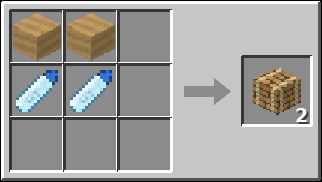

- **Bahan:** 2× Papan Kayu (jenis apa saja), 2× Plastik
- **Hasil:** 2× Fondasi Rakit
- Lantai rakit. Klik kanan ke permukaan air untuk memasangnya langsung di laut.

### Fondasi Diperkuat *(tanpa pola)*

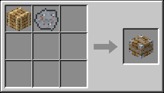

- **Bahan:** 1× Fondasi Rakit, 1× Besi Tua
- **Hasil:** 1× Fondasi Diperkuat
- Tidak bisa digigit hiu.

### Penyaring Air

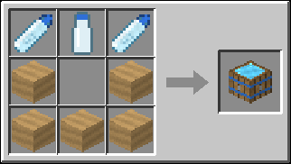

- **Bahan:** 2× Plastik, 1× Botol Kosong, 5× Papan Kayu (jenis apa saja)
- **Hasil:** 1× Penyaring Air
- Masukkan Botol Air Laut, tunggu ±30 detik, ambil Air Bersih dengan Botol Kosong.

### Penampung Air Hujan

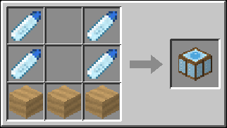

- **Bahan:** 4× Plastik, 3× Papan Kayu (jenis apa saja)
- **Hasil:** 1× Penampung Air Hujan
- Terisi air bersih saat hujan (harus di bawah langit terbuka).

### Pot Tanam

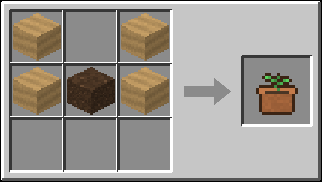

- **Bahan:** 4× Papan Kayu (jenis apa saja), 1× Tanah
- **Hasil:** 1× Pot Tanam
- Tanam bibit gandum, kentang, wortel, atau bit. Bisa dipupuk dengan Bone Meal.

### Layar

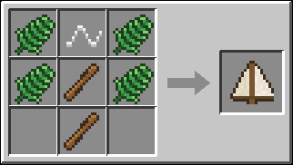

- **Bahan:** 4× Daun Palem, 1× Benang, 2× Tongkat
- **Hasil:** 1× Layar
- Pasang di atas rakit. Makin banyak layar, makin cepat rakit berlayar (maks 3).

### Kemudi

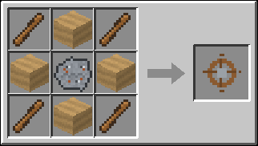

- **Bahan:** 4× Tongkat, 4× Papan Kayu (jenis apa saja), 1× Besi Tua
- **Hasil:** 1× Kemudi
- Pasang di atas rakit, lalu klik kanan untuk mulai/berhenti berlayar ke arah pandanganmu.

### Botol Kosong (Plastik)

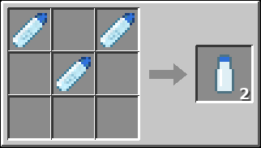

- **Bahan:** 3× Plastik
- **Hasil:** 2× Botol Kosong
- Klik kanan ke air laut untuk mengisi Botol Air Laut.

### Botol Kosong (Kaca) *(tanpa pola)*

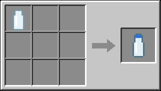

- **Bahan:** 1× Botol Kaca
- **Hasil:** 1× Botol Kosong
- Mengubah botol kaca vanilla menjadi botol Rakitin.

### Tombak

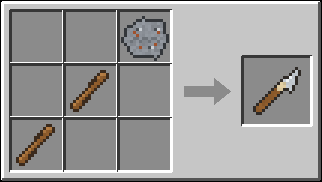

- **Bahan:** 1× Besi Tua, 2× Tongkat
- **Hasil:** 1× Tombak
- Senjata anti-hiu: +6 damage tambahan ke hiu.

### Buku Catatan Rakit *(tanpa pola)*

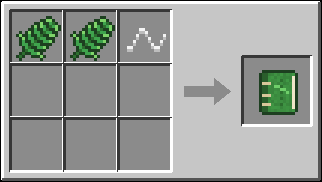

- **Bahan:** 2× Daun Palem, 1× Benang
- **Hasil:** 1× Buku Catatan Rakit
- Klik kanan untuk melihat statistik, pencapaian, dan panduan.

### Tali dari Daun *(tanpa pola)*

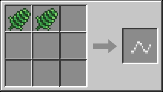

- **Bahan:** 2× Daun Palem
- **Hasil:** 1× Benang
- Sumber benang di tengah laut.

### Tanah Kompos

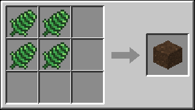

- **Bahan:** 4× Daun Palem
- **Hasil:** 1× Tanah
- Sumber tanah untuk Pot Tanam dan menanam pohon.

### Kail Kayu (Tier 1) *(tanpa pola)*

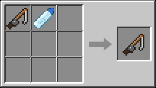

- **Bahan:** 1× Pancingan, 1× Plastik
- **Hasil:** 1× Kail Kayu (Tier 1)
- Kail awal. Klik kanan item kail untuk mengaktifkannya (enchant maksimal).

### Kail Besi (Tier 2)

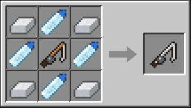

- **Bahan:** 4× Batangan Besi, 4× Plastik, 1× Kail Kayu (Tier 1)
- **Hasil:** 1× Kail Besi (Tier 2)
- Upgrade dari Tier 1.

### Kail Emas (Tier 3)

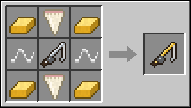

- **Bahan:** 4× Batangan Emas, 2× Gigi Hiu, 2× Benang, 1× Kail Besi (Tier 2)
- **Hasil:** 1× Kail Emas (Tier 3)
- Upgrade dari Tier 2. Gigi Hiu didapat dari mengalahkan hiu.

### Kail Berlian (Tier 4)

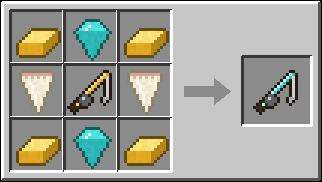

- **Bahan:** 4× Batangan Emas, 2× Berlian, 2× Gigi Hiu, 1× Kail Emas (Tier 3)
- **Hasil:** 1× Kail Berlian (Tier 4)
- Upgrade dari Tier 3.

### Kail Netherite (Tier 5)

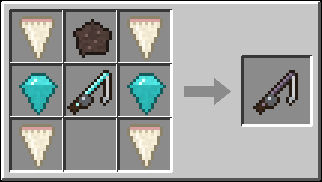

- **Bahan:** 4× Gigi Hiu, 1× Serpihan Netherite, 2× Berlian, 1× Kail Berlian (Tier 4)
- **Hasil:** 1× Kail Netherite (Tier 5)
- Tier tertinggi. Bisa memancing Pecahan Portal.

### Inti Portal End

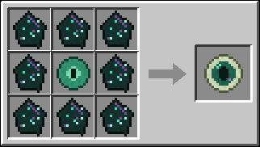

- **Bahan:** 8× Pecahan Portal, 1× Mata Ender
- **Hasil:** 1× Inti Portal End
- Klik kanan di atas rakit untuk membangun Portal End yang langsung aktif.

## Tungku & Api Unggun

### Daging Hiu Matang

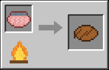

- **Masukan:** Daging Hiu Mentah → **Hasil:** Daging Hiu Matang
- **Alat:** Tungku, Smoker, Api Unggun, Api Unggun Jiwa
- Masak di Tungku, Smoker, atau Api Unggun.

### Rebus Air Laut

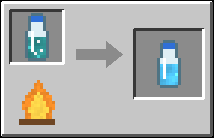

- **Masukan:** Botol Air Laut → **Hasil:** Botol Air Bersih
- **Alat:** Tungku, Api Unggun, Api Unggun Jiwa
- Merebus air laut menjadi air bersih di Tungku atau Api Unggun.

### Lebur Besi Tua

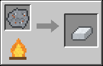

- **Masukan:** Besi Tua → **Hasil:** Batangan Besi
- **Alat:** Tungku, Tanur Tiup
- Mengubah Besi Tua menjadi Batangan Besi.
